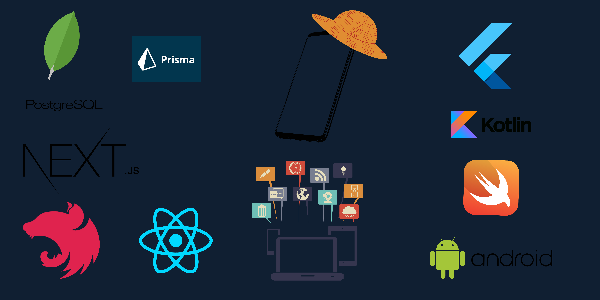

  

<h1>
  👋 Welcome to JOY_BOY GitHub World !
  
  
</h1>

  

## 🌟 About Me

- 🎓 **Student Engineer** specializing in **Full-Stack Mobile Development**.
- 🔍 Currently exploring **AI/ML** and integrating it into innovative mobile apps.
- 🌱 Continuously learning and experimenting with new technologies to expand my skill set.
---

## 📊 GitHub Stats 

 
   

## ⏱️ WakaTime & Activity

  
  

## 📈 Contribution Graph

  

---

### 📌 Core Languages

    

---

### 🖥️ Web Development:

  
  
  

---

### 📱 Mobile Development:

  

      

---

### 🗄️ Databases:

      

---

### ⚙️ **DevOps & API Tools**:

  
  
  
  

---

### 🎨 **Design & Productivity**:

     

---

## 🌍 Let's Connect:

 
   
  
  

  

  <i>💡 "Life is like a GitHub repository—nothing changes if you don't commit." 💻</i>

 
