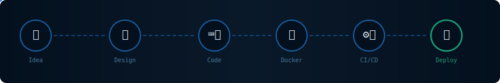
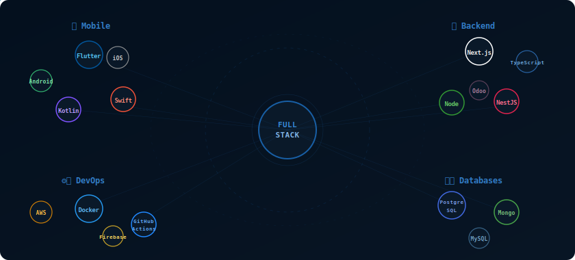

 

&nbsp;

&nbsp;

  

 

 

## `> whoami`

 

 

## `> ./run pipeline.sh`

> 💡 Each stage lights up sequentially — dots animate to show data flowing through the CI/CD chain.

 

 

## `> cat tech-stack.yaml`

 

&nbsp; 📱 <b>Mobile Development</b> — tap to expand badges

 

&nbsp; 🌐 <b>Web & Backend</b> — tap to expand badges

 

&nbsp; ⚙️ <b>DevOps & Cloud</b> — tap to expand badges

 

&nbsp; 🗄️ <b>Databases</b> — tap to expand badges

 

&nbsp; 🎨 <b>Design & Productivity</b> — tap to expand badges

 

 

 

## `> git log --oneline --graph`

 

<table width="100%" align="center">
  <tr>
    <td width="50%" align="center">
      
    </td>
  </tr>
</table>

 

 

 

## `> ssh connect@aminebenjebli`

 

  

&nbsp;

&nbsp;

 

 

## `> ./bj_identity`

  

 

