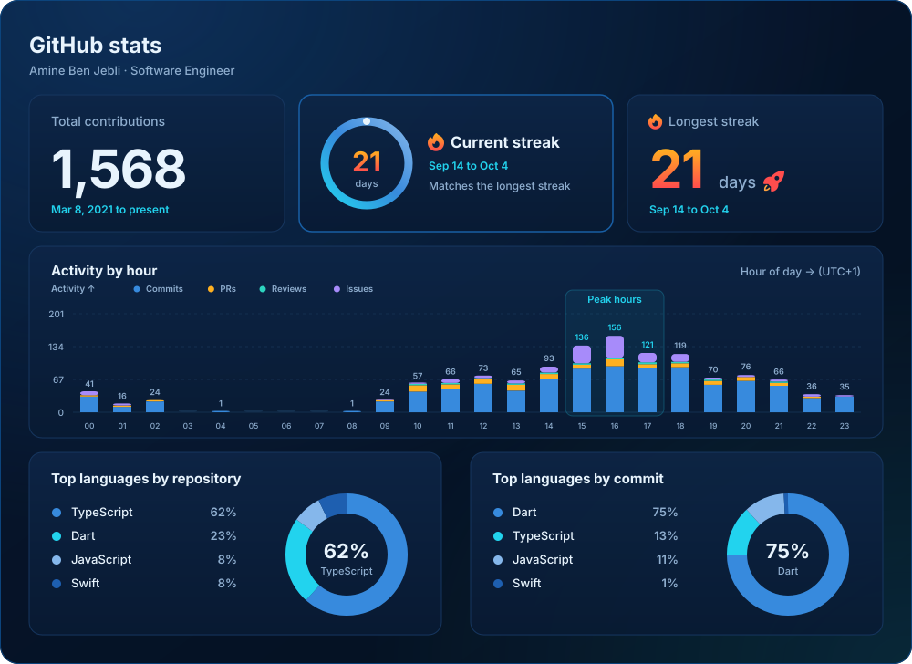

  

&nbsp;&nbsp;

&nbsp;&nbsp;

&nbsp;&nbsp;

 

 

## About &nbsp;<code>$ whoami</code>

Software Engineer at **[Spark Talent Alliance](https://sparktalentalliance.com)**, where I design, build and ship a multi-platform SaaS product: native and cross-platform mobile apps, a web platform, and the backend and delivery pipelines behind them.

I own features from the first wireframe to production, with a strong focus on clean architecture, developer experience and reliable releases.

<table>
<tr><td width="170"><b>Mobile</b></td><td>Flutter for cross-platform, Kotlin and Swift for native Android / iOS</td></tr>
<tr><td><b>Web & Backend</b></td><td>Next.js front ends, NestJS APIs, PostgreSQL / MongoDB</td></tr>
<tr><td><b>DevOps</b></td><td>Dockerized services, GitHub Actions CI/CD, Firebase, automated releases</td></tr>
<tr><td><b>AI integration</b></td><td>Bringing ML and LLM features into mobile and web products</td></tr>
</table>

 

## What I'm building &nbsp;<code>$ cat current-focus.md</code>

 

## Tech stack &nbsp;<code>$ cat tech-stack.yaml</code>

<table>
  <tr>
    <td><b>Mobile</b></td>
    <td>
      
      
      
      
    </td>
  </tr>
  <tr>
    <td><b>Web & Backend</b></td>
    <td>
      
      
      
      
    </td>
  </tr>
  <tr>
    <td><b>DevOps & Cloud</b></td>
    <td>
      
      
      
      
      
    </td>
  </tr>
  <tr>
    <td><b>Databases</b></td>
    <td>
      
      
      
      
    </td>
  </tr>
  <tr>
    <td><b>Design & Tooling</b></td>
    <td>
      
      
      
      
    </td>
  </tr>
</table>

 

## GitHub activity &nbsp;<code>$ git log --oneline --graph</code>

  

 

 

## Let's connect &nbsp;<code>$ ssh connect@aminebenjebli</code>

Junior by title, owner by habit. I ship end to end, mentor teammates and step up when a feature needs someone to drive it. I'm not there yet, but I'm putting in the work to earn it, growing into a Senior Engineer and eventually leading a team. Always open to talk mobile architecture, SaaS platforms and DevOps.

&nbsp;

&nbsp;

 

